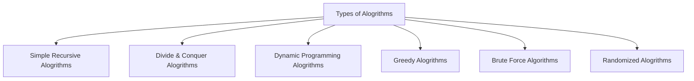

# Algorithms

## Types of Algorithms

```mermaid
flowchart TB
ta["Types of Alogrithms"]
ta-->rs[Simple Recursive Alogrithms]
ta-->dca[Divide & Conquer Alogrithms]
ta-->dpa[Dynamic Programming Alogrithms]
ta-->ga[Greedy Alogrithms]
ta-->bfa[Brute Force Algorithms]
ta-->ra[Randomized Alogrithms]
```