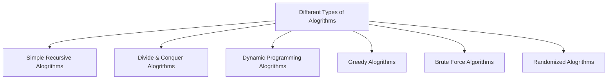

# Algorithms
___

#### Notes
The point of alogrithms is to understand the different methods used to attack a specific coding problem. These are following different types of alogrithms we will use to attack different coding problems given to us.

## Types of Algorithms

### Simple Recursive Algorithm
___
#### Notes
- Recursion Algorithm is a function that calls itself with smaller or simpler input values.
- It's a problem that can be solved by solving smaller instances of the same problem unless that problem is so small that we can just solve it directly.

**Example of a simple Recursive Algorithm**
```
Algorithm Sum(A, n)
    if n = 1
        return A[0]
    s = Sum[A, n-1] /* recurse on all but last */
    s = s + A[n-1] /* add last element */
return s
```

### Divide & Conquer Algorithm
___
#### Notes
- We should divide the problem into small sub-problems of the same type, then then solve these problems recursively.
- We then should combine the solutions of the sub-problems into a final solution to the original problem.

**Example of Divide & Conquer Algorithm**

```

```
### Dynamic Programing Algorithm
___
#### Notes

**Example of Dynamic Programing Algorithm**

```
```
### Greedy Algorithm
___
#### Notes
**Example of Greedy Algorithm**
```
```
### Brute Force Algorithm
___
#### Notes
**Example of Brute Force Algorithm**
```
```
### Randomized Algorithm
___
#### Notes
**Example of Randomized Algorithm**
```
```