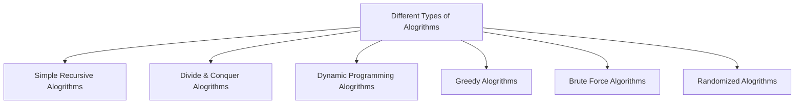

# Algorithms
___

#### Notes

- The point of alogrithms is to understand the different methods used to attack a specific coding problem. 
    These are following different types of alogrithms we will use to attack different coding problems given 
    to us.

## Types of Algorithms

### Simple Recursive Algorithm
___
#### Notes

- Recursion Algorithm is a function that calls itself with smaller or simpler input values.
- It's a problem that can be solved by solving smaller instances of the same problem unless 
    that problem is so small that we can just solve it directly.

**Examples of a simple Recursive Algorithm**
##### python
```python
def openRussianDoll(i):
    if i == 1:
        print("All dolls are opened")
    else:
        openRussianDoll(i-1)
```
##### go
```go
func openRussianDoll(i int) {
    if i == 1 {
        fmt.Println("All dolls are opened")
    } else {
        OpenRussianDoll(i-1)
    }
}
```
##### java
``` java
public class Main {
    public static void main(String[] args) {
        russianDoll(10);
    }
    public static int russianDoll(int i) {
        if (i == 1 ) {
            System.print.out("All dolls are opened");
        } else {
            russianDoll(i-1);
        }
    }
}
```

#### javascript
``` javascript
function russsianDoll(i) {
    if (i == 1) {
        window.alert("All dolls are opened")
    } else {
        russianDoll(i-1)
    }
}
```
##### php
```php
function russianDoll($i) {
    if ($i == 1) {
        echo "All dolls are opened.";
    } else {
        russianDoll($i-1);
    }
}
```

### Divide & Conquer Algorithm
___
#### Notes

- We should divide the problem into small sub-problems of the same type, then then solve these 
    problems recursively.
- We then should combine the solutions of the sub-problems into a final solution to the original problem.

**Example of Divide & Conquer Algorithm**

```

```
### Dynamic Programming Algorithm
___
#### Notes

- Dynanmic Programming Algorithm works based on memorization. It will then use whatever it's memorized 
    to find the best solution among multiple solutions.

**Example of Dynamic Programing Algorithm**

```
```
### Greedy Algorithm
___
#### Notes

- Greedy algorithms will take the best answer we can without worrying about future consequences.
- We hope when using a greedy algorithm that by choosing a local optimum soluion at each step, we
    will end up at a global optimum solution.

**Example of Greedy Algorithm**

```
```
### Brute Force Algorithm
___
#### Notes

- Brute force Alogrithim will use all possiblities to until a satisfacory solution is found.

**Example of Brute Force Algorithm**

```
```
### Randomized Algorithm
___
#### Notes

- Randomized Algorithms will use a random number at least once during the computation to make a decision.

**Example of Randomized Algorithm**

```
```